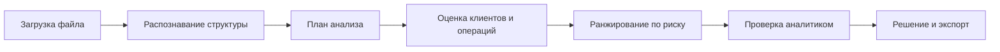
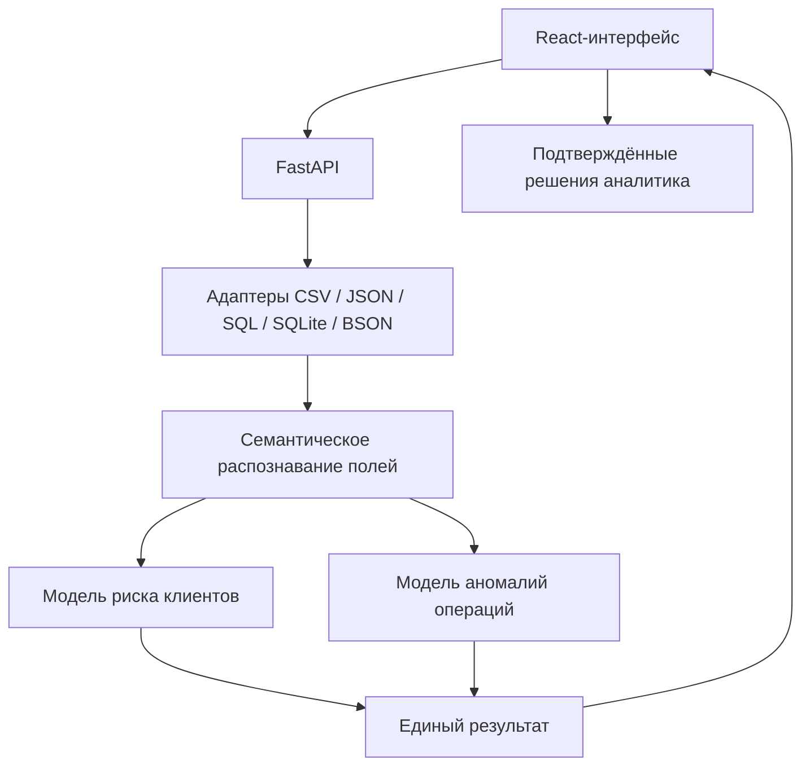

# Risk Ledger

### Локальная аналитическая система для поиска подозрительных клиентов и банковских операций

Risk Ledger принимает банковскую выгрузку, самостоятельно распознаёт её структуру, оценивает риск и показывает аналитику, **кого и что проверить в первую очередь**.

Система не блокирует клиентов и не объявляет операцию мошеннической автоматически. Она ранжирует сигналы, объясняет причины риска и помогает зафиксировать результат ручной проверки.

> **Главный принцип:** прогноз модели — это основание для проверки, а не доказательство мошенничества.

| Локальная обработка | Понятные объяснения | Два профиля анализа | Контроль аналитика |
|---|---|---|---|
| Данные не покидают компьютер | Без сырого JSON и названий признаков | Клиенты и операции | Решение подтверждает человек |

---

## Что получает риск-аналитик

- список клиентов, отсортированный от самого подозрительного;
- список нетипичных операций с уровнем риска и приоритетом проверки;
- понятные причины срабатывания модели на русском языке;
- карточку клиента или операции с отдельной прокруткой и полной историей проверки;
- диаграммы распределения риска и вероятностей;
- связи между клиентами, счетами и операциями;
- предупреждения о качестве загруженных данных;
- показатели качества модели, если в источнике есть фактическая метка;
- журнал решений аналитика и комментарии по расследованию;
- выгрузку полного результата или только записей для ручной проверки.

## Как проходит анализ



1. Аналитик загружает локальный файл.
2. Risk Ledger определяет таблицы, поля, даты, суммы, клиентов, счета и операции.
3. Перед запуском система показывает найденные профили и предполагаемый период данных.
4. Модели рассчитывают риск клиентов и аномальность операций.
5. Самые подозрительные записи выводятся первыми.
6. Аналитик изучает причины, связанные операции и исходные значения.
7. Итог проверки сохраняется со статусом и комментарием.

Если обязательные поля не удалось определить с достаточной уверенностью, запуск блокируется. Система не подставляет случайные колонки в модель.

---

## Быстрый запуск

### Что понадобится

- Docker Desktop;
- Docker Compose v2;
- не менее 4 ГБ доступной оперативной памяти для крупных файлов.

### 1. Запустите приложение

Из корня проекта:

```powershell
docker compose up --build -d --wait
```

### 2. Откройте интерфейс

- **Risk Ledger:** <http://127.0.0.1:8088>
- **API:** <http://127.0.0.1:8000>
- **Документация API:** <http://127.0.0.1:8000/docs>
- **Проверка состояния:** <http://127.0.0.1:8000/api/health>

Проверить контейнеры:

```powershell
docker compose ps
```

Сервисы `frontend` и `backend` должны иметь состояние `healthy`.

### 3. Проведите первую проверку

1. Откройте **«Новый анализ»**.
2. Выберите файл или перетащите его в область загрузки.
3. Проверьте сформированный план и период данных.
4. Нажмите **«Запустить анализ»**.
5. После завершения откройте **«Обзор»**.
6. Перейдите к клиентам и операциям с максимальным риском.
7. Изучите факторы и зафиксируйте решение ручной проверки.

### 4. Завершите работу

В интерфейсе нажмите **«Завершить сессию»**, чтобы удалить временные результаты.

Для остановки приложения:

```powershell
docker compose down --remove-orphans
```

---

## Разделы интерфейса

| Раздел | Для чего нужен | С чего начать |
|---|---|---|
| **Новый анализ** | Загрузка источника и подтверждение плана | Проверьте найденные профили и период |
| **Обзор** | Общая картина риска по выборке | Оцените критические записи и объём ручной проверки |
| **Клиенты** | Ранжирование рискованных клиентов | Открывайте записи сверху вниз |
| **Операции** | Поиск нетипичных транзакций | Начинайте с критического и высокого риска |
| **Связи** | Цепочки клиентов, счетов и операций | Ищите повторяющиеся узлы и сильные связи |
| **Качество модели** | Полнота, точность тревог и ошибки | Смотрите Recall, Precision и матрицу ошибок вместе |
| **Качество данных** | Пропуски, новые категории и лишние поля | Сначала изучите красные и жёлтые замечания |

## Как читать уровень риска

| Уровень | Значение для аналитика |
|---|---|
| **Критический** | Максимальный приоритет ручной проверки |
| **Высокий** | Существенные признаки риска, требуется проверка |
| **Средний** | Есть отклонения, запись нужно изучить в контексте |
| **Низкий** | Явных сильных сигналов не найдено |

Процент риска используется для приоритизации. Например, `92%` означает высокий модельный сигнал, но не вероятность виновности клиента в юридическом смысле.

## Почему запись отмечена

В карточке отображаются только понятные бизнес-пояснения:

- название фактора на русском языке;
- фактическое значение: сумма, количество, период или срок;
- направление влияния — повышает или снижает риск;
- относительная сила влияния;
- связанные операции и предупреждения данных.

Технические названия признаков и сырой JSON не используются в основном рабочем интерфейсе.

## Решения аналитика

Доступные статусы расследования:

- **Новое**;
- **В работе**;
- **Мошенничество подтверждено**;
- **Риск не подтвердился**.

Прогноз модели не становится обучающей меткой автоматически. В хранилище обратной связи попадают только явно подтверждённые решения аналитика. Идентификатор записи сохраняется в обезличенном виде.

---

## Поддерживаемые источники

| Формат | Поддержка |
|---|---|
| CSV | Разделители `,` и `;`, UTF-8, UTF-8 BOM, Windows-1251 |
| JSON | Объект или массив объектов |
| JSONL / NDJSON | Один JSON-объект на строку |
| SQL | `CREATE TABLE`, `INSERT ... VALUES`, PostgreSQL `COPY FROM STDIN` |
| SQLite / SQLite3 / DB | Локальная база в режиме только для чтения |
| BSON | Последовательность обычных BSON-документов |

Ограничения по умолчанию:

- размер файла — до **500 МиБ**;
- количество записей — до **1 000 000**;
- один JSON-документ — до **8 МиБ**;
- SQL разбирается как выгрузка данных и не исполняется как произвольный скрипт;
- SQLite открывается без возможности изменения;
- расширение и фактический формат файла должны совпадать.

## Конфиденциальность

- все запросы выполняются через локальный адрес `127.0.0.1`;
- банковские данные не отправляются во внешние сервисы;
- frontend не содержит рекламы и внешней аналитики;
- исходный файл удаляется после анализа, отмены или ошибки;
- временные результаты удаляются при завершении сессии;
- идентификаторы маскируются по умолчанию;
- экспорт исходных идентификаторов требует отдельного подтверждения;
- CSV-выгрузки защищены от формул электронных таблиц.

Постоянно сохраняются только обезличенная обратная связь и реестр моделей в Docker volume `risk-ledger-data`. Команда `docker compose down -v` удаляет и это локальное хранилище.

---

## Возможные проблемы

### Интерфейс не открывается

```powershell
docker compose ps
```

Если контейнеры не имеют статус `healthy`, пересоберите их:

```powershell
docker compose up --build -d --force-recreate --wait
```

### Файл отклонён

Проверьте расширение, реальный формат, кодировку, размер и структуру. SQL-файл должен содержать выгрузку данных, а не команды администрирования базы.

### План анализа заблокирован

Система не смогла надёжно определить обязательные поля. Убедитесь, что в источнике присутствуют идентификаторы, даты, суммы и другие необходимые бизнес-поля.

### Модель недоступна

Проверьте наличие артефактов клиентской модели в `backend/artifacts/current` и транзакционной модели в `backend/artifacts/transaction/current`.

---

# Техническая информация

## На чём написан проект

| Слой | Технологии |
|---|---|
| Frontend | React 19, TypeScript, Vite, CSS |
| Backend | Python 3.11–3.13, FastAPI, Uvicorn |
| Клиентская модель | CatBoost, SHAP-объяснения |
| Транзакционная модель | Isolation Forest, правила и графовые сигналы |
| Обработка данных | Pandas, NumPy, потоковые адаптеры форматов |
| Тестирование | Pytest, Vitest, Testing Library, axe-core |
| Запуск | Docker Compose, Nginx |

## Архитектура



## Структура проекта

```text
bankFraud/
├── backend/
│   ├── app/                            API, обработка данных и модели
│   ├── artifacts/current/              рабочая модель клиентского риска
│   ├── artifacts/transaction/current/  рабочая транзакционная модель
│   ├── scripts/                        проверки и E2E-сценарии
│   └── tests/                          unit и integration тесты
├── frontend/
│   ├── src/components/                 карточки, графики и элементы интерфейса
│   ├── src/routes/                     страницы аналитической системы
│   ├── src/styles/                     тема и адаптивный дизайн
│   └── tests/                          UI и accessibility тесты
├── data/                               локальные образцы данных
├── ai/specs/                           технические задания и этапы реализации
├── docker-compose.yml                  локальный запуск сервисов
└── README.md
```

## Запуск без Docker

Требуются Python 3.11–3.13, Node.js 22 и npm.

```powershell
py -3.12 -m venv .venv
.\.venv\Scripts\python.exe -m pip install --upgrade pip
.\.venv\Scripts\python.exe -m pip install -e ".\backend[test]"
npm ci --prefix frontend
```

Backend:

```powershell
.\.venv\Scripts\python.exe -m uvicorn app.main:app `
  --app-dir backend --host 127.0.0.1 --port 8000
```

Frontend в отдельном терминале:

```powershell
npm --prefix frontend run dev
```

Интерфейс разработки: <http://127.0.0.1:5173>.

## Обучение моделей

### Клиентский риск

```powershell
python -m app.training.train `
  --input "..\data\Dataset(Лист1).csv" `
  --output "artifacts\candidate-client-2.1.0" `
  --baseline-artifacts "artifacts\current"
```

### Транзакционные аномалии

```powershell
cd backend
python -m app.training.generate_synthetic_transactions `
  --output-dir ..\data\synthetic --seed 20260928 `
  --normal-rows 12000 --clients 240 --days 120

python -m app.training.train_transactions `
  --input ..\data\synthetic\transactions.csv `
  --output artifacts\transaction\candidate-1.1.0 `
  --model-version 1.1.0 --seed 20260928
```

Новая модель регистрируется как кандидат, проходит проверки качества и активируется вручную. Автоматическая бесконтрольная замена рабочей модели не выполняется.

## Проверка проекта

```powershell
python -m pytest backend\tests\unit backend\tests\integration -q -p no:cacheprovider
npm --prefix frontend test -- --run
npm --prefix frontend run lint
npm --prefix frontend run build
docker compose config --quiet
```

---

**Risk Ledger помогает аналитику быстрее находить приоритетные риски, понимать причины сигнала и принимать контролируемое решение — локально и без передачи банковских данных наружу.**
